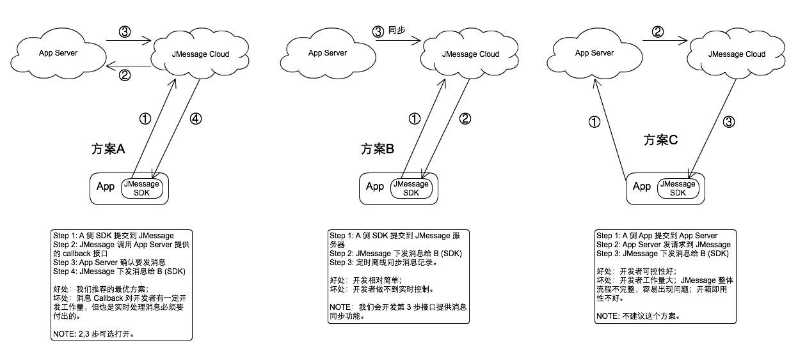
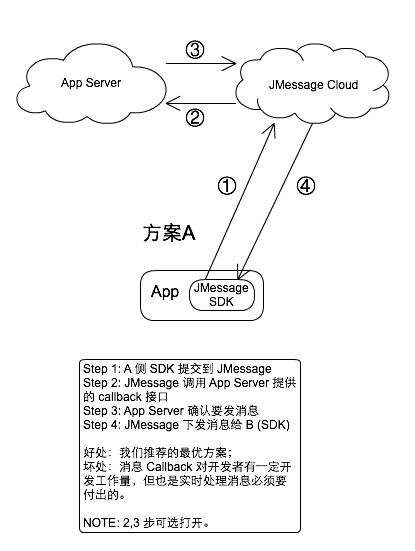
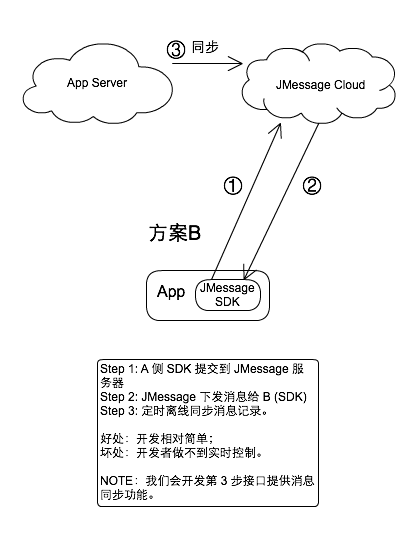
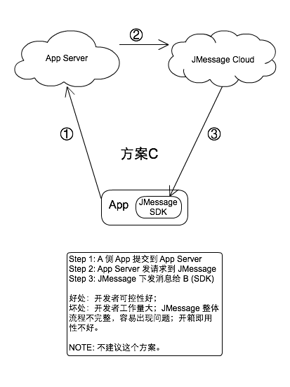

<<<<<<< HEAD
# 极光IM高级话题

本文描述关于极光IM的高级话题，与开发者一起来分析极光IM内在的逻辑与机制。

### Messages 消息过滤与保存

很多开发者都有这个疑问：使用极光IM来做聊天，但我自己要做消息的过滤、保存怎么办。

对于这个需求，有几个基本的思路。如下图所示。

=======
# 极光 IM 高级话题

本文描述关于极光 IM 的高级话题，与开发者一起来分析极光 IM 内在的逻辑与机制。

### 消息过滤与保存

很多开发者都有这个疑问：使用极光 IM 来做聊天，但我自己要做消息的过滤、保存怎么办。

对于这个需求，有几个基本的思路。如下图所示。

>>>>>>> e8ebb19e891ee41f300ee8854a1e907b07df85b2

我们认为方案A是最优方案。方案B请参考[IM report](../server/rest_api_im_report/)文档，因为方案A对于开发者来说代价稍大，如果没有需求就不必做。方案C理论上可以基于极光IM提供的API来实现，但不建议做这个流程。

