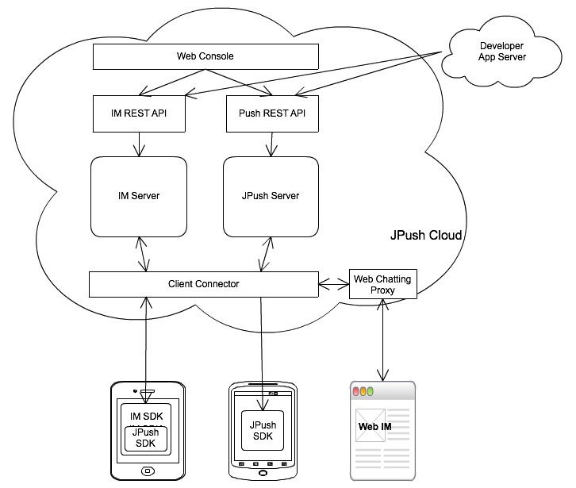

<<<<<<< HEAD
# 极光IM指南

### 认识极光IM

开发者可以通过极光IM 服务快速集成 IM 功能到 App 里。只需要很少的工作，集成 IM SDK，做简单的接口集成，就可以使得自己的 App 具备了用户间聊天的功能。

极光IM（英文名 JMessage）致力于帮助 App 解决 IM 聊天问题。其核心能力在于 IM 聊天本身。其他的附属功能是可选的。 开发者可选择只是单纯注册用户，然后让这些用户之间互发消息，而不使用其他附加功能。

鉴于好友关系的敏感性，我们暂时还未开放这部分功能。

#### JMessage 与 JPush 的关系

JMessage 以 JPush 技术作为基础，共享 JPush 的网络长连接。在保留了 JPush 推送全部功能的基础上增加了 IM 功能。 

集成 JMessage 服务的应用，从客户端 SDK，到服务端 REST API，Web 控制台，都具备并且兼容 JPush 的全部功能。
=======
# JMessage 产品简介

## 认识极光 IM

极光 IM（英文名 JMessage）致力于帮助 App 解决应用内聊天和跨应用聊天问题，开发者可集成SDK，快速实现稳定可靠的聊天功能。目前提供 iOS / Android / web 的 SDK，以及 Rest API 和后台管理系统，满足开发者不同场景下的需求，大大减少开发成本，提高效率。

### JMessage 与 JPush 的关系

JMessage 以 JPush 技术为基础，共享 JPush 的网络长连接，在保留了 JPush 全部功能的基础上增加了 IM 功能。集成 JMessage 服务的应用，从客户端 SDK，到服务端 REST API，Web 控制台，都具备并且兼容 JPush 的全部功能。JPush 用户可以直接集成 JMessage SDK，平滑升级到极光IM，让应用具备聊天功能。
>>>>>>> e8ebb19e891ee41f300ee8854a1e907b07df85b2

	对于同一个应用 JMessage 与 JPush 使用同样的 AppKey。

<<<<<<< HEAD
#### JMessage 与 JPush 的区别
=======
### JMessage 与 JPush 的区别

JMessage 以 IM 使用场景出发，面向用户根据登录帐号来收发消息；而 JPush 则满足推送场景，面向移动设备，根据设备的标签以及使用属性进行推送。
>>>>>>> e8ebb19e891ee41f300ee8854a1e907b07df85b2

  <table border="1" width="100%">
   <thead>
    <tr  bgcolor="#D3D3D3" >
      <th > </th>
      <th >JPush</th>
      <th >JMessage</th>
    </tr>
   </thead>
   <tbody>
    <tr>
      <td>使用场景</td>
      <td>应用推送</td>
      <td>IM聊天、社交 </td>
    </tr>
    <tr >
      <td>面向对象</td>
      <td>设备</td>
      <td>用户、帐号</td>
    </tr>
    <tr >
      <td>消息对象</td>
      <td>App 运营人员或者 App Server 向用户推送</td>
      <td>用户之间互相交流</td>
    </tr>
    <tr >
      <td>发送方式</td>
      <td>支持广播、Tag，或者单设备 </td>
      <td>单聊、群群 </td>
    </tr>
  </table>

 
<<<<<<< HEAD
JMessage 以 IM 使用场景出发，面向用户根据登录帐号来收发消息；而 JPush 则满足推送场景，面向移动设备，根据设备的标签以及使用属性进行推送。

#### 推送与 IM 服务如何选择

开发者可以根据自身业务场景来选择适用的业务。

### JMessage 基本概念

##### username（用户名）

这是 App 的用户名，App 里用来唯一地标识其用户。必须唯一！

App 调用 IM SDK 时实际使用的，可以是其用户的 ID，用户帐号名，或者 Email，总之任何一个唯一地标识其用户的，都可以。

##### groupId（群组ID）

App 使用 JMessage 提供的群组功能创建群组时，得到的群组标识。之后发群组消息、加人踢人等操作，都需要这个群组ID。

##### AppKey（应用Key）

这是 JPush 用来唯一地标识一个 App 的标识，需要在 JPush Web Portal 上去创建。SDK 集成时，需要配置此 Key，以便 JPush 识别当前用户属于某个应用。

同一个 AppKey 里用户名必须唯一！ 不同的 AppKey 之间用户名可以重名。

* 如果你的应用需要实现用户之间相互传递消息的 IM 功能，那么 JMessage 是为您准备的。
* 如果应用主要以发送功能通知，活动推广，订阅与广播内容为主，应该选择更为简洁的推送服务。如果后续业务上需要扩展，可以再集成 JMessage，平滑添加，对原有的 Push 功能无任何影响。

#### JPush 更新后的架构
=======

### JPush 与 JMessage 服务如何选择

开发者可以根据自身业务场景来选择适用的业务。

* 如果你的应用需要实现即时通讯功能，满足用户间的互动需求，那么 JMessage 是为您准备的。
* 如果应用主要以发送功能通知，活动推广，订阅与广播内容为主，应该选择更为简洁的推送服务。如果后续业务需要扩展，可以再集成 JMessage，对原有的 Push 功能无任何影响。

## JMessage 基本概念

### username（用户名）

这是 App 的用户名，App 里用来唯一地标识其用户，必须唯一。

App 调用 IM SDK 时实际使用的，可以是其用户的 ID，用户帐号名，或者 Email，总之任何一个能唯一地标识其用户的都可以。

### groupId（群组ID）

App 使用 JMessage 提供的群组功能创建群组时得到的群组标识。发群组消息、加人、踢人等操作，都需要这个群组ID。

### AppKey（应用Key）

用来唯一标识一个 App，需要在管理控制台创建。SDK 集成时，需要配置此 Key，以便系统识别当前用户属于某个应用。

##### 说明：同一个 AppKey 里用户名必须唯一，不同的 AppKey 之间用户名可以重名。

### JPush 更新后的架构
>>>>>>> e8ebb19e891ee41f300ee8854a1e907b07df85b2

上图是 JPush 新增了 IM 服务后的整体架构图。通过此图可以理解：

<<<<<<< HEAD
+ IM SDK 里支持的推送部分，与 IM 部分使用同一个网络长连接。
+ 服务器端接入服务器在两个服务之间是共享的。
+ 接入服务器之上，二套服务整体相对独立、分离。

#### JMessage 的相对优势

+ 基于 JPush 的大规模、高并发、稳定的推送服务的技术基础，JMessage 服务从刚开始就是相对稳定、可靠、大容量的即时消息服务。
+ IM SDK 与 JPush SDK 合并在一起，一个网络连接同时支持 IM 与 Push 业务。
+ IM 业务与 Push 业务完美集成，先使用 Push 服务时可平滑升级。
+ JPush 团队之前就是开发 IM App 的，对 IM 业务具有更深刻的理解，能够持续地改进与革新 IM 服务。

### JMessage 功能与特性

#### 整体特性

+ 聊天类型：文本、语音、图片。
+ 聊天对象：单聊、群聊。
+ 平台支持：Android, iOS，Web端三平台互通。
+ 用户维护：注册、登录、头像、用户其他信息。
+ 群组维护：创建群组、加群、退群。一个用户最多参与100个群组。
+ 离线消息：单个用户每个会话支持100条离线消息，离线消息和离线事件保存时长分别是15天和7天。

好友关系维护相关功能，稍后的版本提供。

#### 客户端

+ Android 
	+ IM SDK（含 JPush SDK）
	+ Demo （IM 功能完备的 App）
+ iOS 
	+ IM SDK（含 JPush SDK）
	+ Demo （IM 功能完备的 App）
+ Web
	+ 在线 Web IM 登录使用，可进行单聊、群聊。

#### REST API
=======
+ IM SDK 中支持的推送，与 JPush 使用同一个网络长连接。
+ 服务器端接入服务器在两个服务之间是共享的。
+ 接入服务器之上，二套服务整体相对独立、分离。

### JMessage 的优势

+ 以极光推送的大规模、高并发、稳定的推送服务为技术基础，并继承这些特性。
+ IM SDK 与 JPush SDK 合并，一个网络连接同时支持 IM 与 Push 业务。
+ IM 完美兼容 Push ，已使用 Push 服务的用户可平滑升级。
+ JPush 团队之前就是开发 IM App 的，对 IM 业务具有更深刻的理解，能够持续地改进与革新 IM 服务。

## JMessage 功能与特性

### 整体特性

+ 消息类型：文字、语音、图片、地理位置、文件、自定义消息等。
+ 聊天方式：单聊、群聊。
+ 平台支持：Android, iOS，Web 多平台互通。
+ 用户维护：注册、登录、头像、用户其他信息。
+ 群组维护：创建群组、加群、退群。
+ 离线消息：可选择是否需要保存离线消息
+ 关系模式：有好友模式和无好友模式
+ 跨应用聊天：不同应用下的用户相互通信

### REST API
>>>>>>> e8ebb19e891ee41f300ee8854a1e907b07df85b2

提供满足 REST 规范的 HTTP API 来使用常用的功能。

有如下几个类别：

+ 注册用户（支持批量）
+ 发送消息
+ 用户信息维护
<<<<<<< HEAD
+ 群组维护

#### Web Portal

与 JPush 网站控制台集成在一起，可进行除了应用维护之外的操作。

+ 创建应用
+ 发送消息
+ 注册用户
+ 维护群组

### 集成流程

1. 在 Web 控制台上创建应用，得到 AppKey。如果是之前已经使用 JPush，可以直接延用老的 AppKey。
2. 集成客户端 SDK。
	+ 集成 IM SDK 到 App 里。具体参考 Android, iOS 各平台的相应文档。
	+ 如果 App 里之前已经集成过 JPush SDK，则可直接升级换成 IM SDK。
3. 通过 Web 控制台，或者调用 REST API 管理用户，发送消息。

#### Web Client 使用

在 Web 控制台上，应用的展示界面，可以找到该应用的 Web IM 入口。从这个入口，该 App 的用户，可以凭用户名与密码登录，使用 Web 端参与聊天。

以后将发布 Web Client 给开发定制，嵌入到自己的网站上。

### 相关文档

+ [IM SDK for Android](../client/im_sdk_android/)
+ [IM SDK for iOS](../client/im_sdk_ios/)
+ [IM REST API](../server/rest_api_im/)
+ [IM 内部消息协议](../advanced/im_message_protocol/)
+ [IM 业务对象](../advanced/im_objects/)
+ [JPush Android SDK 集成指南](../client/jmessage_android_guide/)

=======
+ 用户关系维护
+ 群组维护

### 管理控制台

与 JPush 控制台集成在一起，可进行用户和群组的一些基本维护。

+ 创建应用
+ 注册用户
+ 管理用户
+ 维护群组

## 集成流程

1. 在 Web 控制台上创建应用，得到 AppKey。如果之前已经使用了 JPush，可以直接延用老的 AppKey。
2. 集成客户端 SDK。
	+ 集成 IM SDK 到 App 里。      
	  Android 开发者请参考文档：[JMessage Android SDK 集成指南](https://docs.jiguang.cn/jmessage/client/jmessage_android_guide/)  
	  iOS 开发者请参考文档：[JMessage iOS SDK 集成指南](https://docs.jiguang.cn/jmessage/client/jmessage_ios_guide/)
      
	+ 如果 App 里之前已经集成过 JPush SDK，则可直接升级换成 IM SDK。
3. 通过管理控制台，或调用 REST API 管理用户，发送消息。

### 相关文档

+ [JMessage Android SDK 开发指南](../client/im_sdk_android/)
+ [JMessage iOS SDK 开发指南](../client/im_sdk_ios/)
+ [JMessage WEB SDK 开发指南](https://docs.jiguang.cn/jmessage/client/im_sdk_js/)

  [1]: ./images/1474528956596.jpg "1474528956596.jpg"
>>>>>>> e8ebb19e891ee41f300ee8854a1e907b07df85b2
